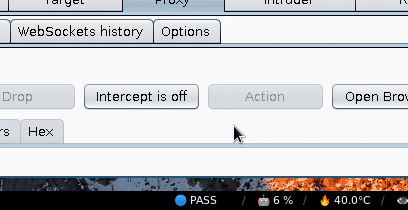

# Burp head-up display - toggle Burp proxy from anywhere and get its status

These scripts allow to display the current status for the Burp proxy
(`INTERCEPT` or `PASS`) in the notification bar, and toggle it with a global
keyboard shortcut **even when the Burp window is not active**.

I've created it for the `i3` window manager and `i3blocks`, but the same
codebase can be adapted to other GUI.




## Installation

_Prerequisites: Burp Community or Burp Pro, ready to handle Jython extension_

1. Save this repo locally;
2. `chmod u+x burpheadup.py`
3. Edit both `burpext_burpheadup.py` and `burpheadup.py`, and set a common `KEY`.
   You can also change the port if you need;
4. In Burp, go to Extender > Extensions > Add, and select `burpext_burpheadup.py`;
5. In the `i3blocks` config file, set a new block with the following:

```
[burp]
command=/PATH/TO/burp-headup/burpheadup.py --get-status
signal=12
```

Edit the `signal` value if it is already used by `i3blocks` or another program,
and change `SIGNAL_NB` in `burpheadup.py`.

6. In the `i3` config file, set the following:

```
bindsym YOUR+SHORTCUT exec /PATH/TO/burp-headup/burpheadup.py --toggle
```

For instance, I set `bindsym Mod4+a exec /foo/bar/burp-headup/burpheadup.py --toggle`

6. Reload `i3`, and test your shortcut. If it seems to fail sometimes, see _Calibration_.

## Caveats

If you toggle the proxy from the Burp interface, clicking the "Intercept is off"
button like it's 1963, the displayed status will get desynchronized. It will
update when you'll use your keyboard shortcut again.

## Calibration

Yes, you heard right, this program _might_ need calibration. See, the Burp
Extender API offers a `setProxyInterceptionEnabled(bool)` function to
enable/disable the proxy, but **does not offer a way to get its current
status**. Too bad, because we need this piece of information to toggle the
proxy.

The good news is that there is actually a way to guess it. The bad news is that
it is hacky as hell.

Depending on the current state of the proxy (`enabled`/`disabled`), the
`setProxyInterceptionEnabled(bool)` will take more or less time to execute. So
we can just time it, and depending of its execution duration, determine its
previous state.

I've added in this repo another Burp Extension, `burpext_calibration.py`,
that you can use to get the right value for you. Install it in Burp, and take a
look at the data in the `Output` tab. You want to choose a value greater than
the `Max` of `Same state durations`, but lower that the `Min` of `Changing state
durations`.


Here are the details for my computer, in seconds:

|  | Turn ON from OFF  | Turn ON from ON | Turn OFF from ON | Turn OFF from OFF
| ---- | ------------- | ------------- | ------------- | ------------- |		
| AVG	| 0,0754646628794 | 0,0001313228800 | 0,0752828217516 | 0,0000808046322 |
| MIN	| **0,0690000057220** | 0,0000000000000 | **0,0699999332428** | 0,0000000000000 |
| MAX	| 0,0820000171661 | **0,0010001659393** | 0,0839998722076 | **0,0010001659393** |

This can be summarized in 

|  | Changing state duration  | Same state duration |
| ---- | ------------- | ------------- | 
| AVG	| 0,075373742315506	| 0,000106063756076 |
| MIN	| **0,069000005722** | 0 |
| MAX	| 0,0839998722076 | **0,00100016593933** |


So in my case, I chose `0.01` second, that allows a good margin of error in case of an operation
being suddenly quicker/slower.


## License

Copyright (C) 2020 Romain RICARD  <contact+burpheadup@romainricard.fr>

This program is free software: you can redistribute it and/or modify
it under the terms of the GNU General Public License as published by
the Free Software Foundation, either version 3 of the License, or
(at your option) any later version.

This program is distributed in the hope that it will be useful,
but WITHOUT ANY WARRANTY; without even the implied warranty of
MERCHANTABILITY or FITNESS FOR A PARTICULAR PURPOSE.  See the
GNU General Public License for more details.

See [LICENSE.md](LICENSE.md) for details.